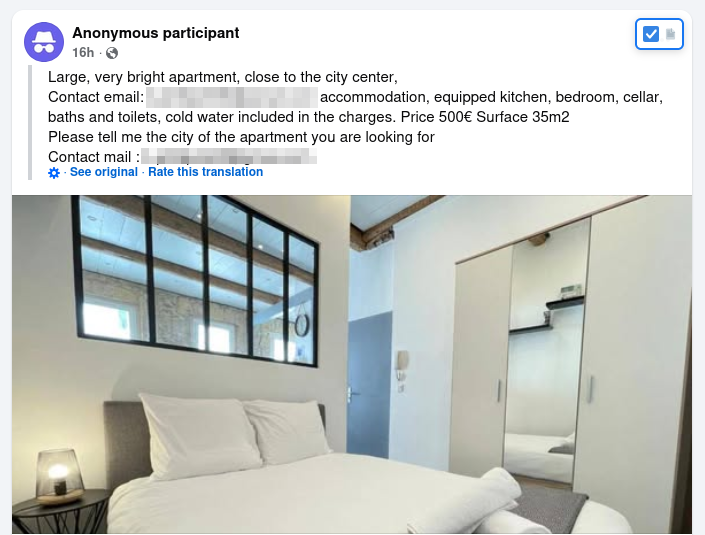
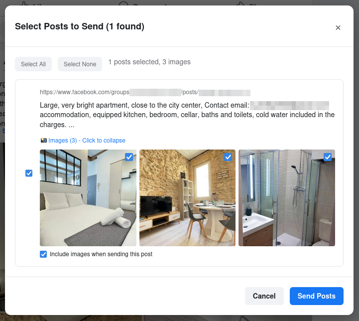

# FB Group Post Data Collector

A userscript for collecting Facebook group posts data with an intuitive selection interface. This tool allows you to extract and export Facebook group posts along with their images to a local API endpoint.


*Facebook group post with selection checkbox overlay*


*Post selection dialog with image management*

## Features

- **Smart Post Detection**: Automatically detects and marks all posts in Facebook group feeds
- **Interactive Selection**: Visual checkboxes overlay on posts for easy selection
- **Content Expansion**: Automatically expands "See more" links to capture full post content
- **Image Support**: Collects and uploads post images with individual selection control
- **Bulk Operations**: Select all, select none, and bulk processing capabilities
- **Real-time Monitoring**: Automatically detects new posts as you scroll
- **Content Quality Validation**: Ensures collected content meets quality standards
- **Local API Integration**: Sends data to localhost:8080 endpoint for processing

## Installation

1. Install a userscript manager:
   - **Chrome/Edge**: [Tampermonkey](https://chrome.google.com/webstore/detail/tampermonkey/dhdgffkkebhmkfjojejmpbldmpobfkfo)
   - **Firefox**: [Tampermonkey](https://addons.mozilla.org/en-US/firefox/addon/tampermonkey/) or [Greasemonkey](https://addons.mozilla.org/en-US/firefox/addon/greasemonkey/)
   - **Safari**: Not supported
   - **Mobile**: Not supported

2. Install the userscript by clicking on `greasyfork-release/fb-group-post-export.user.js` and copying the content to your userscript manager.

## Setup

### Prerequisites
- A local server running on `http://localhost:8080` with the following endpoints:
  - `POST /fetch_post` - Receives post data
  - `POST /upload` - Receives image uploads

### Server API Requirements

**POST /fetch_post**
```json
{
  "posts": [
    {
      "post_id": "123456789",
      "post_url": "https://www.facebook.com/groups/123/posts/456",
      "post_content": "The full text content of the post..."
    }
  ],
  "timestamp": "2025-01-28T12:00:00.000Z",
  "source": "facebook-group-post-collector",
  "version": "v1.0"
}
```

**POST /upload** (multipart/form-data)
- `listing_id`: The submission ID from the fetch_post response
- `file`: Image blob with appropriate filename

## Usage

1. Navigate to any Facebook group page (e.g., `https://www.facebook.com/groups/[GROUP_ID]`)

2. The userscript will automatically:
   - Add checkboxes to all visible posts
   - Show a "Collect Posts" button in the top-right corner
   - Display bulk control options

3. Select posts by clicking the checkboxes (posts are numbered for easy reference)

4. Click "Collect Posts" to:
   - Process selected posts and expand "See more" content
   - Open the selection dialog with full post content preview
   - Allow individual image selection for posts with images

5. In the selection dialog:
   - Review and modify your post selection
   - Toggle image inclusion for each post
   - Click "Send Posts" to export to your local API

## Post Processing Features

- **Content Expansion**: Automatically clicks "See more" buttons to get full post text
- **Content Cleaning**: Removes UI artifacts and focuses on actual post content
- **Image Extraction**: Finds and processes post images with metadata
- **Quality Validation**: Ensures content meets minimum quality standards

## Compatibility

- **Supported Browsers**: Chrome, Firefox, Edge (via userscript managers)
- **Not Supported**: Mobile devices, Safari, Internet Explorer
- **Facebook Pages**: Works on Facebook group pages only

## Troubleshooting

### Common Issues

1. **"Cannot connect to localhost:8080"**
   - Ensure your local server is running
   - Check that the endpoints `/fetch_post` and `/upload` are available
   - Verify CORS settings allow requests from Facebook

2. **Posts not detected**
   - Click the "Rescan Posts" button in the bulk controls
   - Try scrolling to load more posts, then rescan

3. **Content expansion not working**
   - Some posts may not have "See more" buttons
   - The script will use available content if expansion fails

### Debug Features

The script includes debug menu commands accessible through your userscript manager:
- "Debug: Show Collection Status" - Shows current selection state
- "Debug: Test Content Cleaning" - Tests the content cleaning functionality

## Version History

- **v1.0**: Initial release with post collection and export functionality

## License

MIT License - See LICENSE file for details.
